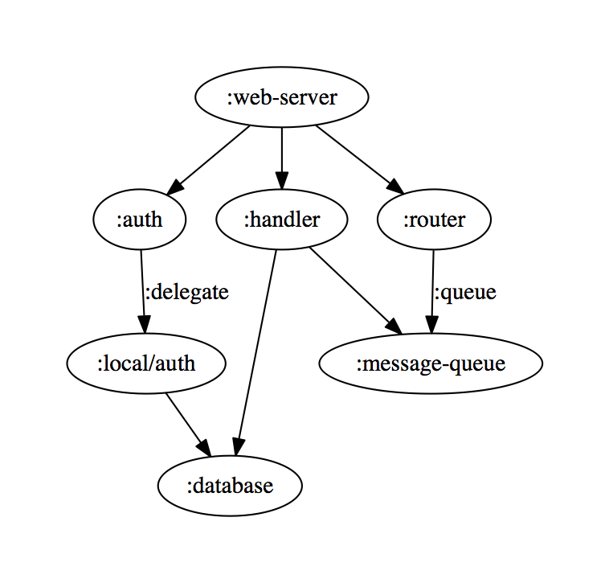
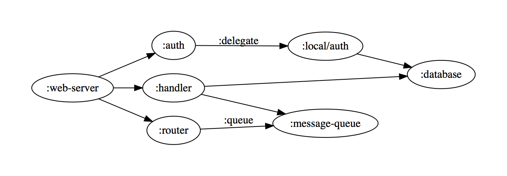
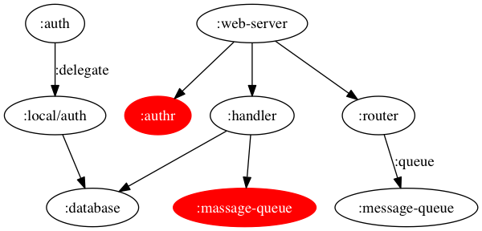
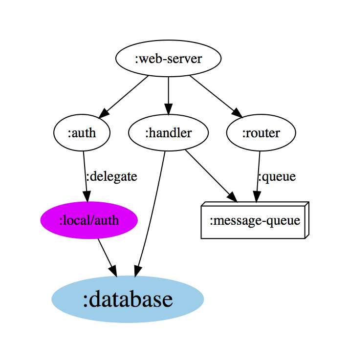

# system-viz

[](https://clojars.org/walmartlabs/system-viz)

system-viz is a tiny, simple library to visualize
a system, constructed using Stuart Sierra's
[component](https://github.com/stuartsierra/component)
library.


Use of this project requires that [Graphviz](http://www.graphviz.org) is installed, which can be checked by running `dot -V` at the command line.  If it's not installed, you can do the following:

| platform | directions |
|----------|------------|
| Linux | install `graphviz` using your package manager |
| OS X | [download the installer](http://www.graphviz.org/Download_macos.php) |
| Windows |  [download the installer](http://www.graphviz.org/Download_windows.php) |


[API documentation](http://walmartlabs.github.io/apidocs/system-viz/)

## Usage

Here, we are creating a very hypothetical stand-in for some kind of system:

```clj
(require '[com.walmartlabs.system-viz :refer [visualize-system]]
         '[com.stuartsierra.component :as component])

(def sys
  (component/system-map
    :auth (component/using {} {:delegate :local/auth})
    :local/auth (component/using {} [:database])
    :database (component/using {} [])
    :handler (component/using {} [:database :message-queue])
    :message-queue {}
    :router (component/using {} {:queue :message-queue})
    :web-server (component/using {} [:auth :router :handler])))

(visualize-system sys)
```

This will open a window displaying an image somewhat like:



Dependencies between components are shown as arrows; the arrows are only labeled
when the component's local key for the dependency is different from the target component's system key.

visualize-system returns the system it is passed; it is intended as a filter used for
side effects (creating and opening the graph image).

## Horizontal Output

Some systems will render more readibly with a horizontal layout.

```clj
(visualize-system sys {:horizontal true})
```

will render as:



## Broken Systems

Sometimes, in larger and more complex projects, you may have errors in your inter-component
dependencies.
The component library detects this, but the exception can be extremely difficult to parse.

system-viz can help here: it will identify dependencies that link to non-existent components,
highlighting the missing components in red:



## Customizing

The visual representation of the components in the graph can be adjusted for
specific nodes, using particular component keys in the `:systemviz` namespace.

Example:

```c;j

(require '[com.walmartlabs.system-viz :refer [visualize-system]]
         '[com.stuartsierra.component :as component])

(def sys
  (component/system-map
    :auth (component/using {} {:delegate :local/auth})
    :local/auth (component/using {:systemviz/color :magenta} [:database])
    :database (component/using {:systemviz/highlight true} [])
    :handler (component/using {} [:database :message-queue])
    :message-queue {:systemviz/attrs {:shape :box3d}}
    :router (component/using {} {:queue :message-queue})
    :web-server (component/using {} [:auth :router :handler])))
```



## Customization Component Attributes

`:systemviz/color`

Sets the color of the node to the provided value, and sets the style of the node
to filled.

`:systemviz/highlight`

Sets the color of the node to a light blue, and increases the font size from
the default 14 point to 24 point.

`:systemviz/attrs`

Allows the specification of arbitrary [Graphviz node attributes](https://graphviz.gitlab.io/_pages/doc/info/attrs.html)
as a nested map of keys and values.
Values should be strings, numbers, or keywords and will be quoted as
necessary.

## Customization Options

Two options to `visualize-system` support customization:

`:highlight`

Defines the set of GraphViz node attributes used when a component
has the `:systemviz/highlight` attribute.

`:decorator`

A function that is passed each component's key and component map
and return nil, or a map of GraphViz node attributes.

For example, this could allow easy customization of components
based on the namespace of thier component keys, or other
factors.

## License

Copyright © 2015-2018 Walmart Labs

Distributed under the Apache Software License 2.0.
